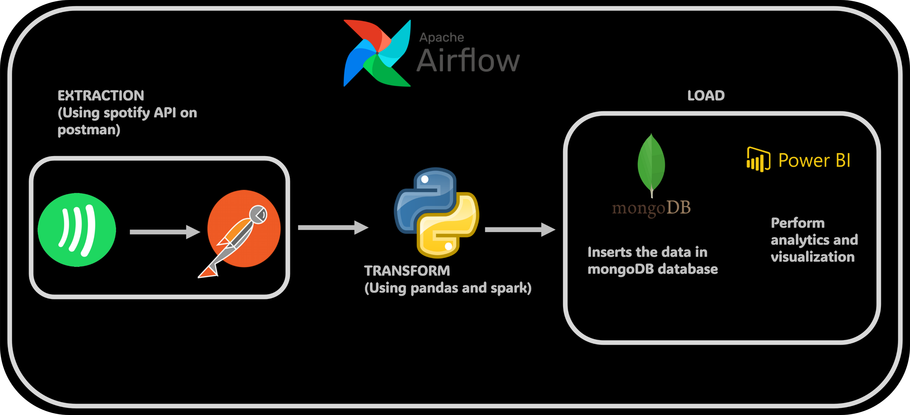

# Spotify_pipeline
In this project i have demonstrated how to fetch the data from Spotify using an API Token. The extracted data is then transformed with certain data analysis using Jupyter Notebook with Python programming language. It is then loaded to MongoDB database to create the collection using Pymongo library. I have also showcased how to use the transformed data to visualise using Seaborn and Matplotlib library.

Spotify API
Python
MongoDb
Seaborn
Matplotlib

